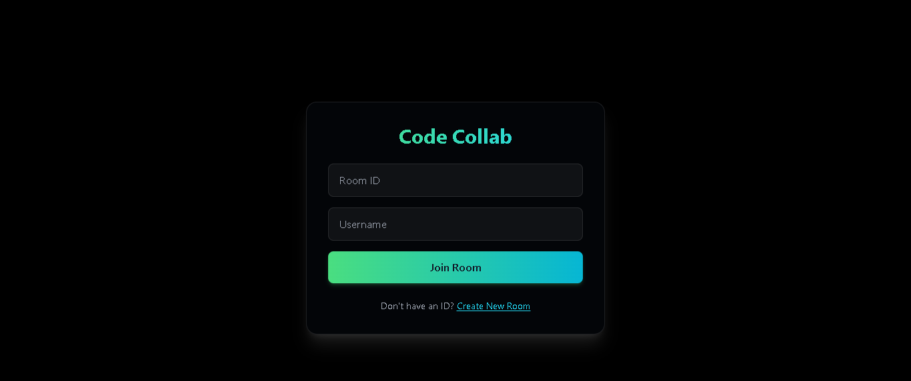
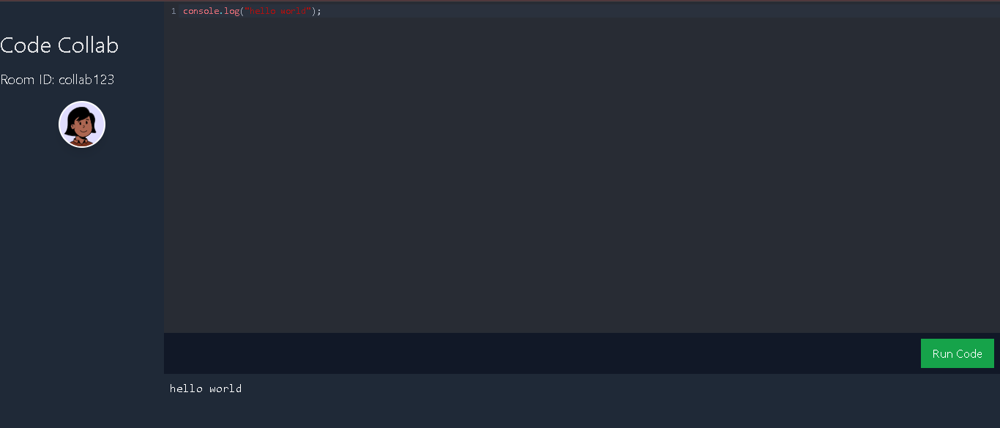

# Collaborative Code Editor

## Google Docs for Devs

Welcome to the **Collaborative Code Editor**, a real-time, multiplayer coding environment where developers can join a room using a unique Room ID and code together seamlessly. Think Google Docs, but for developers—see changes live, collaborate instantly, and build projects together!

🚀 **Live Demo**: [(https://collaborative-code-editor-black.vercel.app/)]  

📸 **Screenshots**: 

---

## ✨ Features

- **Real-Time Collaboration**: Multiple users can code simultaneously with live updates.
- **Unique Room IDs**: Join or create coding sessions with a unique ID.
- **Monaco Editor**: Powered by VS Code’s editor for a pro coding experience.

---

## 🛠️ Technologies

- **Frontend**: React, Monaco Editor
- **Backend**: Node.js
- **Real-Time Communication**: Socket.IO

---

## 🚀 Getting Started

- Click on the link
- Create our own room or generate a new room id
- Copy room id and share it with your friends
